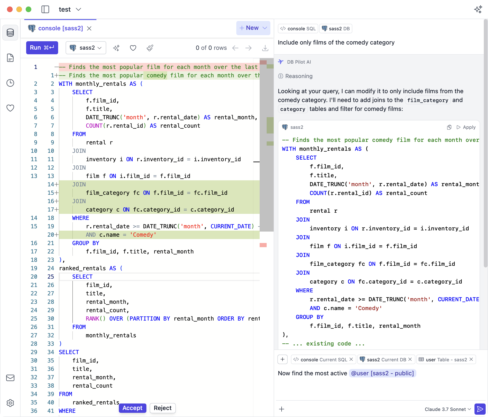
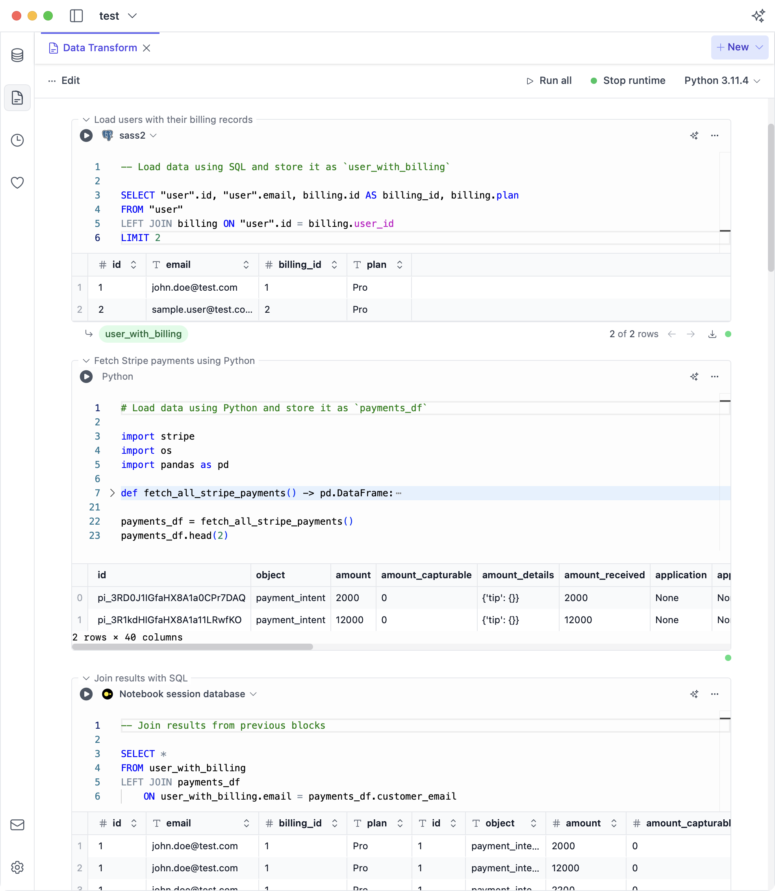
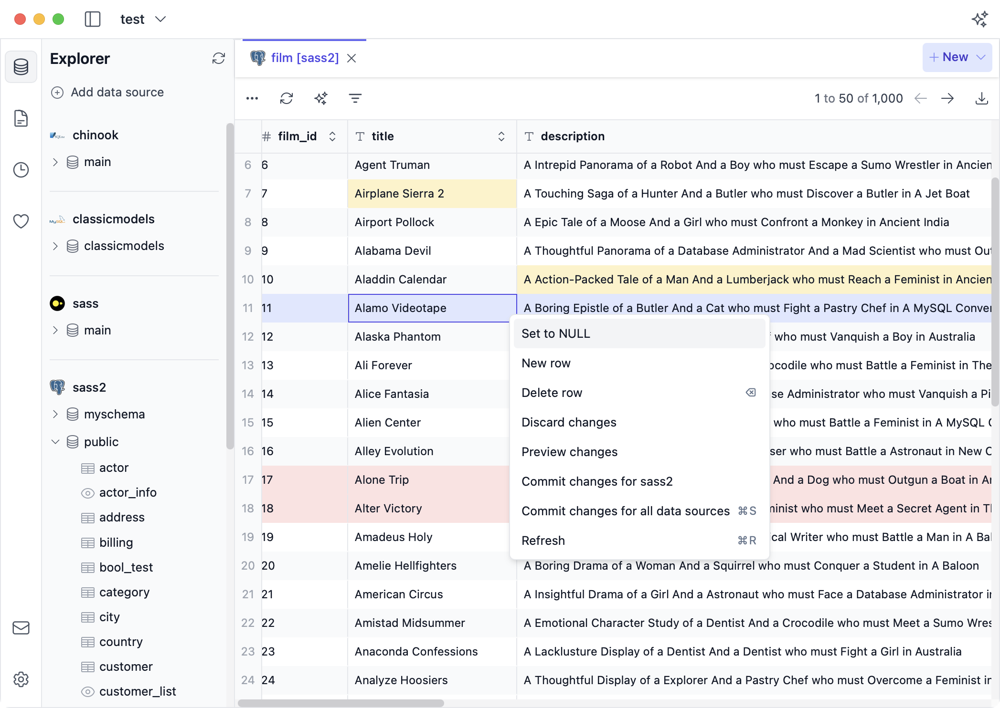

  <svg height="48" viewBox="0 0 732 616" fill="none" xmlns="http://www.w3.org/2000/svg">
    <path d="M324.885 269.704C322.478 269.704 320.1 269.178 317.918 268.164C315.735 267.15 313.8 265.671 312.247 263.832L129.131 46.3422C127.391 44.2778 126.183 41.8188 125.612 39.1799C125.041 36.5411 125.125 33.8026 125.856 31.2036C126.587 28.6045 127.943 26.2238 129.805 24.2694C131.668 22.315 133.981 20.8462 136.542 19.9913L193.991 0.852627C196.38 0.0543435 198.92 -0.187762 201.417 0.144778C203.914 0.477319 206.302 1.37572 208.399 2.77146L486.861 188.468C489.433 190.19 491.471 192.599 492.742 195.422C494.013 198.244 494.467 201.366 494.052 204.434C493.636 207.501 492.369 210.39 490.393 212.773C488.417 215.156 485.812 216.936 482.875 217.912L330.079 268.844C328.408 269.419 326.652 269.709 324.885 269.704Z" fill="#6366F1"/>
    <path d="M234.75 384.255H74.2955C71.276 384.256 68.314 383.43 65.7305 381.867C63.147 380.304 61.0406 378.064 59.6396 375.389L1.8926 265.42C-0.144929 261.535 -0.555897 257 0.750089 252.812C2.05607 248.624 4.97205 245.127 8.85664 243.089C9.68014 242.644 10.5442 242.278 11.4371 241.997L48.7386 229.822C50.9563 229.096 53.3026 228.848 55.6233 229.093C57.9439 229.338 60.1865 230.072 62.2035 231.245L143.77 278.67L643.908 111.963C658.681 107.081 674.691 107.484 689.199 113.104C700.964 117.552 711.131 125.415 718.395 135.684C724.499 144.114 728.534 153.862 730.176 164.14C731.817 174.418 731.017 184.938 727.842 194.85C724.667 204.762 719.205 213.788 711.897 221.2C704.59 228.611 695.641 234.2 685.775 237.514L255.691 380.881C248.939 383.131 241.867 384.271 234.75 384.255Z" fill="#818CF8"/>
    <path d="M356.05 615.839H288.014C283.627 615.839 279.419 614.096 276.317 610.994C273.215 607.892 271.472 603.684 271.472 599.297C271.468 598.186 271.579 597.077 271.803 595.989L328.375 313.126C328.948 310.269 330.266 307.614 332.195 305.43C334.123 303.245 336.595 301.609 339.359 300.687L489.491 250.599C492.503 249.592 495.741 249.474 498.818 250.259C501.895 251.043 504.682 252.696 506.845 255.021C509.008 257.346 510.456 260.245 511.016 263.371C511.576 266.496 511.224 269.717 510.003 272.649L371.318 605.666C370.061 608.679 367.94 611.253 365.223 613.063C362.506 614.873 359.314 615.839 356.05 615.839Z" fill="#6366F1"/>
  </svg>
  <h1>DB Pilot - Feature Requests & Bug Reports</h1>

This repository contains feature requests and bug reports for [DB Pilot](https://www.dbpilot.io).

**💡 Requesting a feature and reporting bugs:**

- Please check existing [requests / bug reports](https://github.com/DB-Pilot/dbpilot/issues).
- If you don't find what you're looking for, please [open a new issue](https://github.com/DB-Pilot/dbpilot/issues/new).

---

 

**DB Pilot is an AI-Native Database Tool for Mac.**

- **SQL + Python Notebooks for Data Exploration & Dashboards**
- **Powerful SQL Editor with smart autocomplete**
- **Edit database records as easy as updating a spreadsheet**
- **AI Assistant with the latest models from OpenAI, Anthropic, Google, and xAI**

<a class="" href="/download" style="text-size-adjust: 100%; tab-size: 4; font-family: Inter var,ui-sans-serif,system-ui,sans-serif,&quot;Apple Color Emoji&quot;,&quot;Segoe UI Emoji&quot;,Segoe UI Symbol,&quot;Noto Color Emoji&quot;; font-feature-settings: normal; font-variation-settings: normal; -webkit-tap-highlight-color: transparent; --background: 0 0% 100%; --foreground: 20 14.3% 4.1%; --muted: 60 4.8% 95.9%; --muted-foreground: 25 5.3% 44.7%; --popover: 0 0% 100%; --popover-foreground: 20 14.3% 4.1%; --card: 0 0% 100%; --card-foreground: 20 14.3% 4.1%; --border: 20 5.9% 90%; --input: 20 5.9% 90%; --primary: 24 9.8% 10%; --primary-foreground: 60 9.1% 97.8%; --secondary: 60 4.8% 95.9%; --secondary-foreground: 24 9.8% 10%; --accent: 60 4.8% 95.9%; --accent-foreground: 24 9.8% 10%; --destructive: 0 72.2% 50.6%; --destructive-foreground: 60 9.1% 97.8%; --ring: 20 14.3% 4.1%; --radius: .5rem; --sidebar-background: 0 0% 98%; --sidebar-foreground: 240 5.3% 26.1%; --sidebar-primary: 240 5.9% 10%; --sidebar-primary-foreground: 0 0% 98%; --sidebar-accent: 240 4.8% 95.9%; --sidebar-accent-foreground: 240 5.9% 10%; --sidebar-border: 220 13% 91%; --sidebar-ring: 217.2 91.2% 59.8%; --tw-border-spacing-x: 0; --tw-border-spacing-y: 0; --tw-translate-x: 0; --tw-translate-y: 0; --tw-rotate: 0; --tw-skew-x: 0; --tw-skew-y: 0; --tw-scale-x: 1; --tw-scale-y: 1; --tw-pan-x: ; --tw-pan-y: ; --tw-pinch-zoom: ; --tw-scroll-snap-strictness: proximity; --tw-gradient-from-position: ; --tw-gradient-via-position: ; --tw-gradient-to-position: ; --tw-ordinal: ; --tw-slashed-zero: ; --tw-numeric-figure: ; --tw-numeric-spacing: ; --tw-numeric-fraction: ; --tw-ring-inset: ; --tw-ring-offset-width: 0px; --tw-ring-color: rgb(59 130 246 / .5); --tw-ring-offset-shadow: 0 0 #0000; --tw-ring-shadow: 0 0 #0000; --tw-shadow: 0 0 #0000; --tw-shadow-colored: 0 0 #0000; --tw-blur: ; --tw-brightness: ; --tw-contrast: ; --tw-grayscale: ; --tw-hue-rotate: ; --tw-invert: ; --tw-saturate: ; --tw-sepia: ; --tw-drop-shadow: ; --tw-backdrop-blur: ; --tw-backdrop-brightness: ; --tw-backdrop-contrast: ; --tw-backdrop-grayscale: ; --tw-backdrop-hue-rotate: ; --tw-backdrop-invert: ; --tw-backdrop-opacity: ; --tw-backdrop-saturate: ; --tw-backdrop-sepia: ; --tw-contain-size: ; --tw-contain-layout: ; --tw-contain-paint: ; --tw-contain-style: ; box-sizing: border-box; border-width: 0; border-style: solid; --tw-border-opacity: 1; border-color: hsl(var(--border) / var(--tw-border-opacity, 1)); text-decoration: inherit; height: 2.5rem; align-items: center; justify-content: center; gap: .5rem; white-space: nowrap; border-radius: calc(var(--radius) - 2px); --tw-bg-opacity: 1; background-color: rgb(79 70 229 / var(--tw-bg-opacity, 1)); padding-left: 1rem; padding-right: 1rem; padding-top: .5rem; padding-bottom: .5rem; font-size: .875rem; line-height: 1.25rem; font-weight: 500; --tw-text-opacity: 1; color: rgb(255 255 255 / var(--tw-text-opacity, 1)); --tw-ring-offset-color: hsl(var(--background) / 1); transition-property: color,background-color,border-color,text-decoration-color,fill,stroke; transition-timing-function: cubic-bezier(.4,0,.2,1); transition-duration: .15s; display: flex; width: fit-content;"><!--[--><svg xmlns="http://www.w3.org/2000/svg" width="16" height="16" viewBox="0 0 24 24" fill="none" stroke="currentColor" stroke-width="2" stroke-linecap="round" stroke-linejoin="round" class="lucide-icon lucide lucide-download mr-2 h-4 w-4"><!--[--><!----><path d="M21 15v4a2 2 0 0 1-2 2H5a2 2 0 0 1-2-2v-4"><!----></path><!----><!----><polyline points="7 10 12 15 17 10"><!----></polyline><!----><!----><line x1="12" x2="12" y1="15" y2="3"><!----></line><!----><!--]--><!----><!----><!----><!----></svg><!--]--> Download<!----></a>

**➡️ Visit our website to learn more:** [https://www.dbpilot.io](https://www.dbpilot.io)

---

## SQL + Python Notebooks

<video 
    src="assets/release-1.4.0-notebook-timeseries.mp4" 
    playsinline
    autoplay
    muted
    loop
    alt="Notebooks for dashboards" 
    style="margin-top: 2rem; display: block; vertical-align: middle; max-width: 100%; height: auto; max-height: 500px; width: auto; border-radius: 0.5rem; box-shadow: 0 0 0 1px rgb(156 163 175 / .1), 0 20px 25px -5px rgb(0 0 0 / .1), 0 8px 10px -6px rgb(0 0 0 / .1); border-width: 0px; border-style: solid; border-color: hsl(20, 5.9%, 90%);"></video>

## Table Editor

